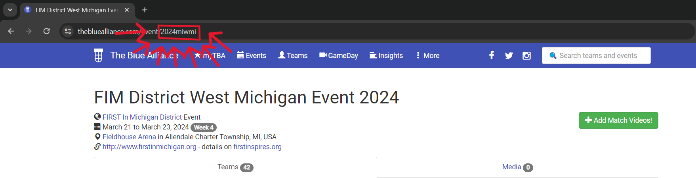

# 6002 ZooBOTix's scouting script using TBA's & statbotics API's. 
## version 2.0 includes more comments and less unecessary code
Running this script requires a TBA read key from https://thebluealliance.com/account,
in a json file named X-TBA-Auth-Key.json in the format of {"key": "your-TBA-Auth-Key-here"}.

You also need a service account from Google and the credentials from that in a json file called credentials.json
To set up a Google service account, follow these docs: https://support.google.com/a/answer/7378726?hl=en.
The service account will need admin permission and access to the Google sheets API.

When you first run this, update the event key(s) for the events you want team info from.
To find the event key, open the event page in TBA for your event and copy the characters shown from the URL

